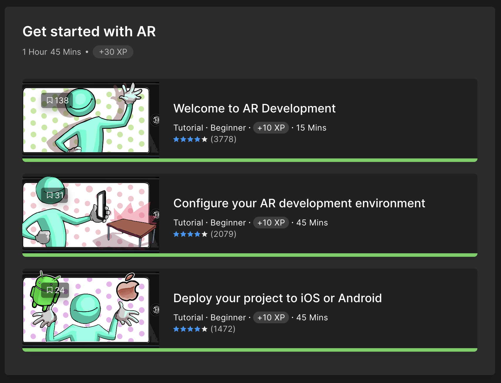
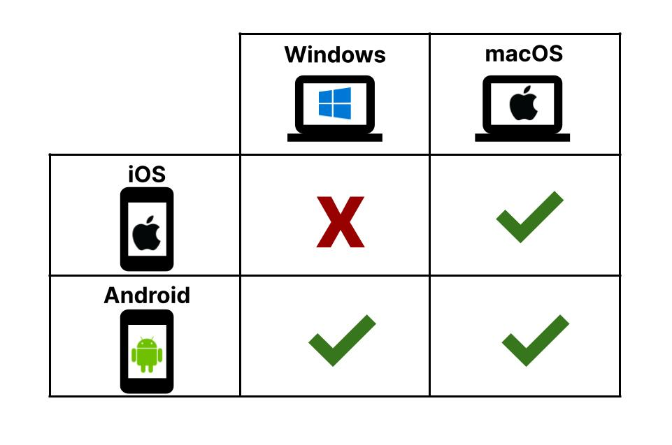
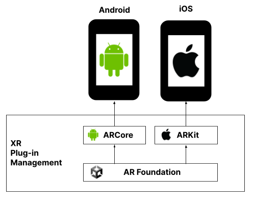
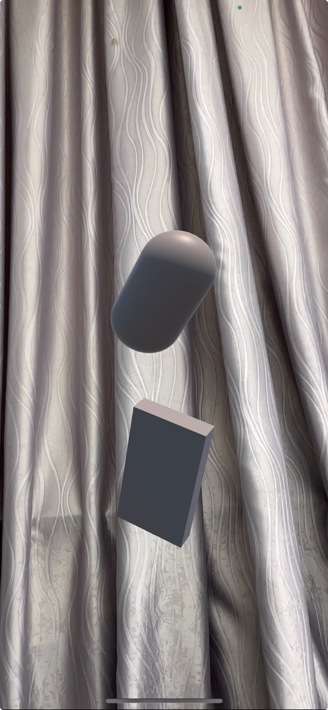

# AR Start Demo

This repository contains a simple AR start demo created by following the Unity tutorial: [Get Started with AR](https://learn.unity.com/mission/get-started-with-ar?uv=2021.3&pathwayId=63e3a4c1edbc2a344bfe21d8).

## Key Learnings

### System Requirements

Before diving into AR development, ensure that your computer meets the necessary .

### Related Packages

To create this AR experience, several key Unity packages were utilized:

- **[AR Foundation](https://docs.unity3d.com/Packages/com.unity.xr.arfoundation@4.2/manual/index.html):**
  Provides all the essential GameObjects and classes needed to develop interactive AR experiences in Unity.

- **[ARCore](https://developers.google.com/ar/develop):**
  Android's AR framework. AR Foundation communicates with ARCore to enable AR features on Android devices.

- **[ARKit](https://developer.apple.com/documentation/arkit/):**
  Apple's AR framework. AR Foundation communicates with ARKit to enable AR features on Apple devices.

- **[XR Plugin Management](https://docs.unity3d.com/Manual/com.unity.xr.management.html):**
  A management tool for platform-specific XR plugins, such as ARKit and ARCore.  
  

- **[Platform-Specific Feature Support](https://docs.unity3d.com/Packages/com.unity.xr.arfoundation@4.2/manual/index.html#platform-support):**
  A detailed guide on specific feature support per platform.

### Basic AR GameObjects

Three essential GameObjects are used to set up an AR experience in Unity:

- **AR Session Origin:**

  - Represents the device's position in space. When the user moves or rotates in the real world, the AR Session Origin moves accordingly within the Unity scene.
  - It contains the AR Camera GameObject, which simulates the real device's camera.

- **AR Camera:**

  - The AR Camera (a child of AR Session Origin) serves as the main camera for the AR application. It must be tagged as `MainCamera`.
  - It is recommended to delete any other cameras in the scene to prevent conflicts.

- **AR Session:**
  - Manages an individual session of the AR experience, including frame rate and communication with the device.
  - Only one AR Session should be active in a scene.

### Build and Deploy for iOS

To build and deploy the AR application on iOS, ensure the following prerequisites are met:

- Unity Hub
- Unity Version: `2020.3.1f1`
- Xcode
- An iOS device

Follow the standard build and deployment process in Unity to run the demo on your iOS device.

## Results

Here’s a demo of the AR application running on an iOS device:

  

